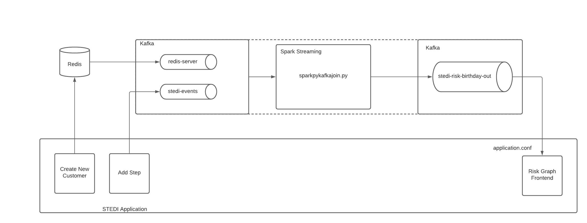
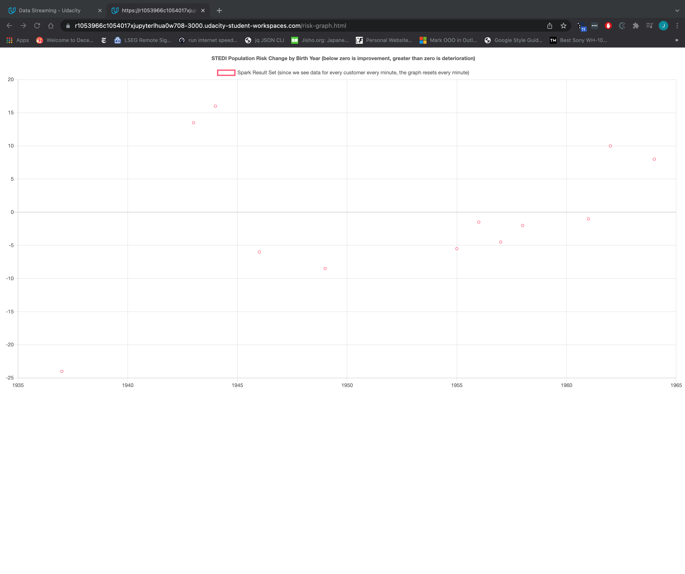
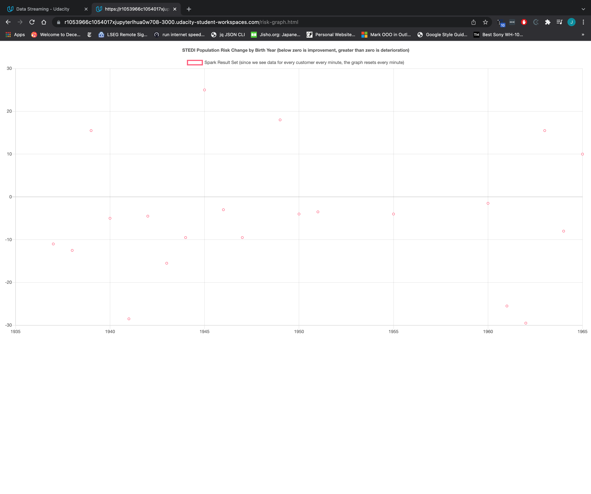

# Evaluating Human Balance with Streaming Data
This repository is the codebase for the final project in the udacity data streaming nanodegree.

In this project, we were given an applicationm, the STEDI application, which was publishing real time events to a Kafka cluster, 
and we were required to consume that data, join it together, and then emit the joined data to a new topic, to which the application
subscribed and used to generated a dynamic plot of te risk data.

There were two input data streams, which are both generated by the STEDI application. There is static data that's emitted every
time a new customer (senior citizen) is added to the application databse (a redis instance).

In addition, every time a senior citizen goes through the physical therapy assessment, data is emitted about the number of steps they can take,
which is emitted to a Kafka topic.

Our job was to take these two data streams as input, join them together, and then emit a new data stream containing the joined data.

The joined data was used by the application to create a dynamic plot on a separate page of the web application.

The architecture for this project looks like this following:

# The STEDI Application
You work for the data science team at STEDI, a small startup focused on assessing balance for seniors. 
STEDI has an application that collects data from seniors during a small exercise. 
The user logs in, and then selects the customer they are working with. 
Then the user starts a timer, and clicks a button with each step the senior takes. 
When the senior has reached 30 steps, their test is finished. The data transmitted enables the application to monitor seniors’ balance risk. 
# The Data
The first data source in this project consisted of creating new entries in our Redis database every time we have a new customer
that's using our application. 

This data is generated by the STEDI applicaiton, and sent to a Redis data base. Then, we have a Kafka Connect Redis connector,
which reads that data, and pushes it to a Kafka topic called `redis-server`. The events being emitted from this data are formatted
in the usual Redis formatting when you try to consume them, which looks like this: 
```json
{
  "key":"__Customer__",
  "existType":"NONE",
  "Ch":false,
  "Incr":false,
  "zSetEntries":[{
    "element":{
      "customerName":"Sam Test", 
      "email":"sam.test@test.com",
      "phone":"8015551212",
      "birthDay":"2001-01-03"
    },
    "Score":0.0
  }],
  "zsetEntries":[{
    "element":{
      "customerName":"Sam Test",
      "email":"sam.test@test.com",
      "phone":"8015551212",
      "birthDay":"2001-01-03"
    },
    "score":0.0
  }]
}
```

The actual data that was emitted by the STEDI application is the bit inside the `element` dictionaries, inside the `zSetEntries` lists.
This data will need to be parsed out in our spark streaming application when we subscribe to this data stream.

Then, there's the risk score data, which is dynamic, and generated by the STEDI application every time senior citizens make a certain number
of steps.

This data looks like this:
```json
{
  "customer": "Jason.Mitra@test.com",
  "score": 7.0,
  "riskDate": "2020-09-14T07:54:06.417Z"
}
```
# Working with Redis
One of our data sources is a Redis key value store. You can interact with this Redis instance by running the Redis CLI with this command:
```bash
/data/redis/redis-stable/src/redis-cli -a notreally
```

In this case, this assumes you have the Redis CLI executable at that path, and the password to the Redis cluster is `notreally`.
Once you're inside the Redis CLI, you can display our Customer static data from the sorted set they were added to like this:
```bash
zrange Customer 0 -1
```

You could consume the data that's being added to Redis, parsed with the Kafka connector, then loaded into a kafka `redis-server` topic
using a kafka console consumer:
```bash
kafka-console-consumer --bootstrap-server localhost:9092 --topic redis-server
```

To add new static data entries ot our sorted set, you could add a new entry from the Redis CLI like this:
```bash
zadd Customer 0 "{\"customerName\":\"Sam Test\",\"email\":\"sam.test@test.com\",\"phone\":\"8015551212\",\"birthDay\":\"2001-01-03\"}"
```

Then, if your kafka console consumer was still open and running, you should see a new entry come through there.
# The Submitted Files
## Python Scripts
In this project, there were three Python script that needed to be edited.

The first of the files was the sparkpyrediskafkastreamtoconsole.py file. This file contained the PySpark code to read the static
data from the Redis database, and then to simply output that data to the console to test that that single data stream was working.

The second python file was sparkpyeventskafkastreamtoconsole.py. This file contained the PySpark code to take the risk score
event data being generated by the use of the STEDI application, and also output that data to the console, to make sure that piece
also works independently.

Finally, in the sparkpykafkajoin.py file, we put the contents of the above two files together, and we join the two resulting
streams based on the email of the customer. 

We sink this data to an output Kafka topic. The name of this topic is placed in the application.conf file, which the STEDI application
uses to know where to consume the final data from.
## Images
For the final submission we were required to add two screenshots of our plot being updated with the streaming data.
This is proof that reading from the two individual streams and performing the join was working, and then the results of that
stream were being plugged into the frontend.

Here is the first plot:


Here is the second plot:


While simplistic, it is clear to see how this application could be extended or re-purposed to automatically update a dashboard that 
business actually cared about in an application.
## Log Files
In addition to the python files, and the screenshots of the working applications, we were also required to submit the log
file of the resulting output to make sure that the environment was correctly configured, and to make sure that we were getting
the correct output.
### Spark Logs
To make sure that the spark master node, and the worker node was set up correctly, and configured to work with one another, we submitted
a spark--org.apache.spark.deploy.master.Master-1-1704a2a4c612.out file and a spark--org.apache.spark.deploy.worker.Worker-1-1704a2a4c612.out file.

The Master log file contains information about the URI the master node is running on.

That URI needs to be used when starting up the worker node. 

The worker log file needs to contain the line that it "Successfully registered with master [MASTER URI]".

This tells that the worker node was correctly configured to work with the master node we set up.

# Closing Thoughts
This project was relatively straightforward. It was mainly an exercise in learning the functionality that's specific to the spark
streaming library.

The most difficult part was the encoding/decoding pieces, and parsing out of the JSON fields. Making sure the syntax for that was correct
and making sure that I was able to tell if particular data needed to be decoded or parsed out, or whether the data had the Redis schema
formatting around the actual data I was interested in was the most difficult part of the project. 
